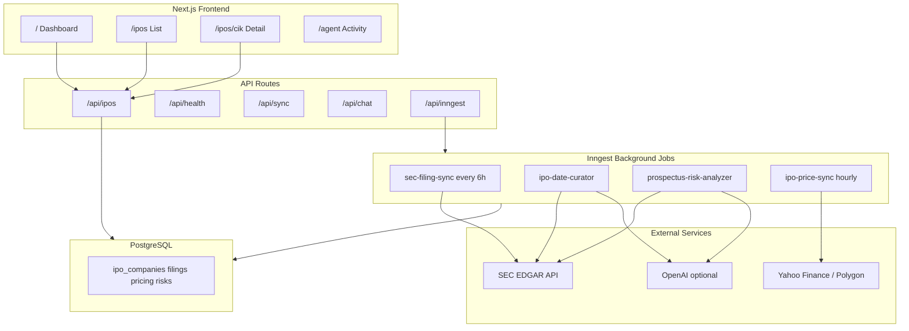

# IPO Tracker — Full Application Guide

This document provides complete context for developers, operators, and users of the **IPO Tracker** application in the `genAIacademy-project-1` repository.

---

## What This Application Does

IPO Tracker is an IPO-centric investment research platform that:

1. **Discovers IPOs** from publicly available SEC EDGAR filings (S-1, S-1/A, F-1, 424B4, EFFECT)
2. **Curates target IPO dates** using a background agent that reads SEC documents and infers timing with confidence scores
3. **Evaluates investment risks** by parsing prospectus Risk Factors and producing structured assessments
4. **Tracks performance** of IPOs listed in the last 6 months — offer price, opening day price, current price, and return %
5. **Presents everything in a web UI** with dashboard, searchable IPO directory, detail pages, and optional per-IPO chat

> **Disclaimer:** This app aggregates public data for research. It is not investment advice. Always verify against official SEC filings.

---

## Architecture Overview



---

## Project Structure

```
/workspace
├── src/
│   ├── app/                      # Next.js pages and API routes
│   │   ├── page.tsx              # Dashboard
│   │   ├── ipos/                 # IPO list and detail pages
│   │   ├── agent/                # Agent activity log
│   │   └── api/                  # REST endpoints
│   ├── components/               # UI (tables, charts, badges)
│   ├── db/                       # Drizzle schema and connection
│   ├── inngest/                  # Background job definitions
│   └── lib/
│       ├── sec/                  # SEC EDGAR client and parsers
│       ├── market/               # Yahoo / Polygon price providers
│       ├── agent/                # Date curator and risk analyzer
│       └── ipo/                  # Core business logic / service layer
├── scripts/seed.ts               # Initial SEC data backfill
├── drizzle.config.ts             # Database migration config
├── .env.example                  # Environment variable template (no secrets)
└── vercel.json                   # Vercel deployment config
```

---

## Data Sources

| Source | What It Provides | Auth Required |
|--------|------------------|---------------|
| **SEC EDGAR** (`data.sec.gov`, `efts.sec.gov`) | S-1 filings, amendments, 424B4 prospectuses, EFFECT notices | `SEC_USER_AGENT` header only (no API key) |
| **Yahoo Finance** (default) | Opening/current stock prices, historical OHLC | None (unofficial API) |
| **Polygon.io** (optional) | Production-grade market data | `POLYGON_API_KEY` |
| **OpenAI** (optional) | LLM date curation and risk analysis | `OPENAI_API_KEY` |

### SEC Filing Types Used

| Filing | Purpose |
|--------|---------|
| S-1 / S-1/A | Initial IPO registration; may contain expected offering window |
| F-1 / F-1/A | Foreign company IPO equivalent |
| EFFECT | Registration declared effective — strong pre-listing signal |
| 424B4 | Final prospectus with confirmed offer price |
| 8-K | IPO completion announcements |

---

## Database Schema

| Table | Purpose |
|-------|---------|
| `ipo_companies` | Company name, CIK, ticker, status, exchange, listing date |
| `ipo_filings` | SEC filing history per company (form type, accession, URLs) |
| `ipo_date_estimates` | Agent-curated target IPO date with confidence and reasoning |
| `ipo_pricing` | Offer price, opening price, current price, return calculations |
| `ipo_risk_assessments` | Structured risk analysis from prospectus |
| `agent_runs` | Audit log of background job executions |
| `price_snapshots` | Daily price history for 6-month charts |

---

## Background Agent Pipelines

### 1. SEC Filing Sync (`sec-filing-sync`)
- **Schedule:** Every 6 hours
- **Action:** Searches SEC EFTS for IPO-related filings in the last 90 days
- **Output:** Upserts companies and filings into PostgreSQL
- **Triggers:** Date curation events for upcoming IPOs

### 2. IPO Date Curator (`ipo-date-curator`)
- **Trigger:** New or amended S-1 filing
- **Action:**
  1. Downloads relevant SEC documents
  2. Extracts date signals (roadshow, effective date, listing mentions)
  3. Uses LLM (or fallback heuristics) to synthesize target date + confidence
- **Output:** Record in `ipo_date_estimates` with cited source filings

### 3. Prospectus Risk Analyzer (`prospectus-risk-analyzer`)
- **Trigger:** After date curation, when S-1/A or 424B4 is available
- **Action:**
  1. Downloads prospectus HTML
  2. Extracts Risk Factors section
  3. LLM produces structured assessment (overall risk, top risks, summary)
- **Output:** Record in `ipo_risk_assessments`

### 4. Price Sync (`ipo-price-sync`)
- **Schedule:** Hourly
- **Action:** For IPOs listed in last 6 months with tickers, fetches offer/opening/current prices
- **Output:** Updates `ipo_pricing` and `price_snapshots`

---

## User-Facing Pages

### Dashboard (`/`)
- KPI cards: upcoming IPO count, listed in last 6 months, average return
- Quick lists of upcoming IPOs and top price movers

### IPO Directory (`/ipos`)
- Sortable table: company, status, curated date, risk level, offer/open/current prices, return %
- Filters: status, risk level, search by name/ticker/CIK
- "Sync SEC Data" button for manual refresh

### IPO Detail (`/ipos/[cik]`)
- Company header with SEC EDGAR link
- Pricing cards: offer, opening day, current, return vs offer
- Agent insights panel: curated date reasoning + risk assessment
- 6-month price chart with offer/open reference lines
- SEC filing timeline with direct links
- Optional chat: ask questions about the IPO (requires OpenAI)

### Agent Activity (`/agent`)
- Log of recent background job runs with status and errors

---

## Environment Variables & Secret Safety

### What is safe to commit

| File | Safe? | Notes |
|------|-------|-------|
| `.env.example` | Yes | Contains **placeholder values only** — copy to `.env.local` and fill in real values |
| Source code | Yes | References `process.env.*` — never hardcodes secrets |
| `README.md`, `APPLICATION.md` | Yes | Documentation only |

### What must NEVER be committed

| File / Value | Why |
|--------------|-----|
| `.env`, `.env.local`, `.env.production` | Contain real credentials |
| `DATABASE_URL` with real password | Database access |
| `OPENAI_API_KEY` | Paid API access |
| `POLYGON_API_KEY` | Paid API access |
| `INNGEST_SIGNING_KEY`, `INNGEST_EVENT_KEY` | Job orchestration auth |

These are excluded via `.gitignore`:
```
.env
.env*.local
```

### Required variables (set in Vercel dashboard or `.env.local`)

```bash
DATABASE_URL=postgresql://...          # From Neon/Supabase — never commit
SEC_USER_AGENT="IPOTracker you@email.com"  # Your real email for SEC compliance
```

### Optional variables

```bash
OPENAI_API_KEY=sk-...               # Enables full LLM agent features
MARKET_DATA_PROVIDER=polygon          # Default: yahoo
POLYGON_API_KEY=...                 # If using Polygon
INNGEST_EVENT_KEY=...               # Auto-set by Vercel marketplace
INNGEST_SIGNING_KEY=...             # Auto-set by Vercel marketplace
NEXT_PUBLIC_APP_URL=https://...     # Your deployed URL
```

---

## Setup Instructions

### Local development

```bash
git clone https://github.com/mgujra/genAIacademy-project-1.git
cd genAIacademy-project-1
npm install
cp .env.example .env.local
# Edit .env.local with your real DATABASE_URL and SEC_USER_AGENT
npm run db:push
npm run seed
npm run dev
```

### Production (Vercel)

1. Import repo from GitHub
2. Create Neon or Supabase PostgreSQL database
3. Add all env vars in Vercel Project Settings → Environment Variables
4. Install Inngest from Vercel Marketplace
5. Deploy

Verify deployment: `GET https://your-app.vercel.app/api/health`

---

## API Reference

| Endpoint | Method | Auth | Description |
|----------|--------|------|-------------|
| `/api/ipos` | GET | None | List IPOs. Query: `status`, `riskLevel`, `search`, `page` |
| `/api/ipos/[cik]` | GET | None | Full IPO detail |
| `/api/ipos/[cik]/performance` | GET | None | Price history and returns |
| `/api/agent/analyze/[cik]` | POST | None | Queue manual agent re-analysis |
| `/api/sync` | POST | None | Trigger manual SEC sync |
| `/api/chat` | POST | None | Streaming IPO Q&A (needs OpenAI) |
| `/api/health` | GET | None | System status |
| `/api/inngest` | GET/POST/PUT | Inngest signing | Background job handler |

---

## Fallback Behavior (No API Keys)

The app works without optional keys:

| Feature | Without `OPENAI_API_KEY` | Without `POLYGON_API_KEY` |
|---------|--------------------------|---------------------------|
| Date curation | Heuristic fallback from EFFECT/424B4/signals | N/A |
| Risk analysis | Keyword-based extraction | N/A |
| Market prices | N/A | Uses Yahoo Finance (default) |
| Chat | Disabled with clear message | N/A |

---

## Security Checklist Before Pushing

- [ ] No `.env` or `.env.local` files in `git status`
- [ ] `.env.example` contains only placeholders
- [ ] No API keys, tokens, or real passwords in any source file
- [ ] `SEC_USER_AGENT` uses your email only in local/Vercel env — not in committed code
- [ ] Database credentials set only in deployment platform

Run before committing:
```bash
git status                    # Should not list .env or .env.local
git ls-files | grep '\.env'   # Should only show .env.example
```
