# IPO Tracker — Application Architecture

This document describes the overall architecture of the IPO Tracker application. It is intended for developers, operators, and technical users who want to understand how the system is structured, how data flows through it, and how components interact.

For setup instructions and API details, see [README.md](README.md) and [APPLICATION.md](APPLICATION.md).

---

## 1. Architectural Style

IPO Tracker is a **full-stack, event-driven monolith** deployed as a single Next.js application on Vercel, with:

- **Server-rendered UI** for fast initial page loads
- **API routes** for data access and agent triggers
- **Background workers** (Inngest) for long-running SEC ingestion and AI analysis
- **PostgreSQL** as the system of record
- **External APIs** for SEC filings, market prices, and optional LLM inference

This design keeps deployment simple (one Vercel project) while offloading durable, multi-step agent work to Inngest so it does not hit serverless timeout limits.

---

## 2. High-Level System Diagram

```mermaid
flowchart TB
  subgraph users [Users]
    Browser[Web Browser]
  end

  subgraph vercel [Vercel Platform]
    subgraph nextjs [Next.js Application]
      Pages[App Router Pages]
      API[API Routes]
      InngestHandler["/api/inngest"]
    end
  end

  subgraph inngestCloud [Inngest Cloud]
    Scheduler[Cron Scheduler]
    EventBus[Event Bus]
    WorkerPool[Durable Step Executor]
  end

  subgraph data [Data Layer]
    Postgres[(PostgreSQL)]
  end

  subgraph external [External Services]
    SEC[SEC EDGAR API]
    Yahoo[Yahoo Finance]
    Polygon[Polygon.io]
    OpenAI[OpenAI API]
  end

  Browser --> Pages
  Browser --> API
  Pages --> Postgres
  API --> Postgres
  API --> InngestHandler
  InngestHandler <--> inngestCloud
  Scheduler --> WorkerPool
  EventBus --> WorkerPool
  WorkerPool --> SEC
  WorkerPool --> Yahoo
  WorkerPool --> Polygon
  WorkerPool --> OpenAI
  WorkerPool --> Postgres
```

---

## 3. Layered Architecture

The application is organized into five logical layers:

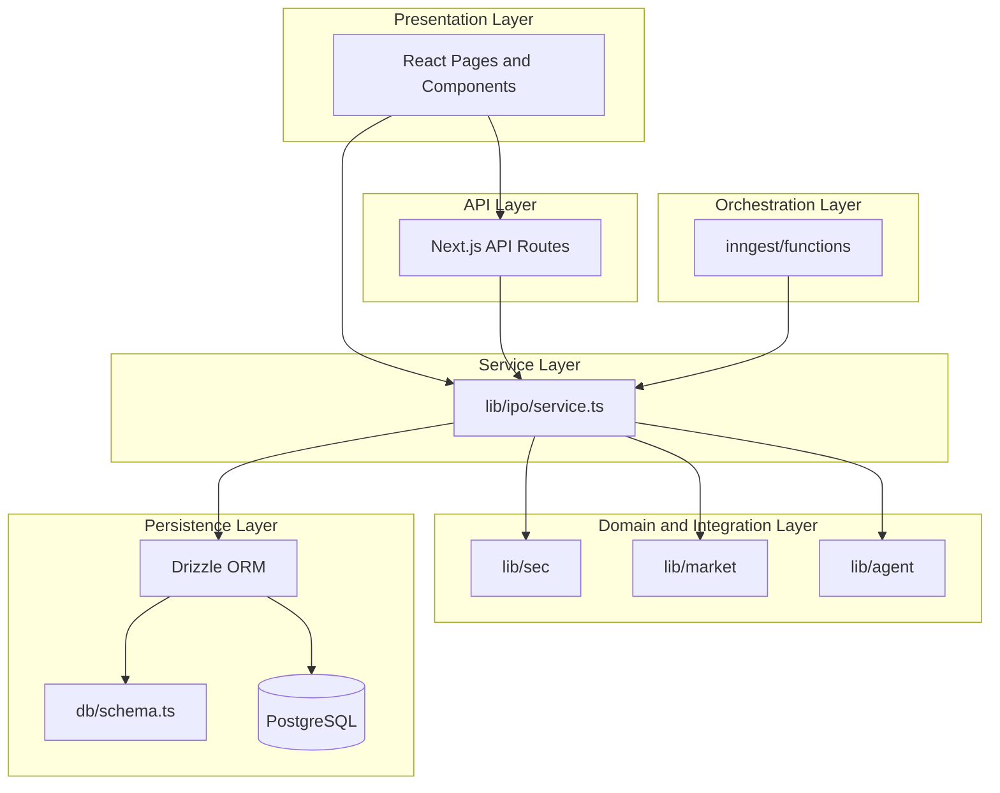

### Layer responsibilities

| Layer | Location | Responsibility |
|-------|----------|----------------|
| **Presentation** | `src/app/`, `src/components/` | Dashboard, IPO list/detail pages, charts, filters, chat UI |
| **API** | `src/app/api/` | REST endpoints for IPOs, health, sync, chat, Inngest webhook |
| **Service** | `src/lib/ipo/service.ts` | Business logic: sync filings, run agents, query IPOs, update prices |
| **Domain / Integration** | `src/lib/sec/`, `src/lib/market/`, `src/lib/agent/` | SEC client, parsers, market data abstraction, AI agent prompts |
| **Persistence** | `src/db/` | Drizzle schema, typed queries, PostgreSQL connection |
| **Orchestration** | `src/inngest/` | Cron schedules, event triggers, durable multi-step workflows |

---

## 4. Component Map

### 4.1 Frontend pages

| Route | File | Rendering | Data source |
|-------|------|-----------|-------------|
| `/` | `src/app/page.tsx` | Server Component | `getDashboardStats()` |
| `/ipos` | `src/app/ipos/page.tsx` | Server + Client | `listIpos()` + client filters |
| `/ipos/[cik]` | `src/app/ipos/[cik]/page.tsx` | Server + Client | `getIpoDetail()` + chat client |
| `/agent` | `src/app/agent/page.tsx` | Server Component | `getRecentAgentRuns()` |

### 4.2 API routes

| Endpoint | File | Purpose |
|----------|------|---------|
| `GET /api/ipos` | `src/app/api/ipos/route.ts` | Paginated IPO list with filters |
| `GET /api/ipos/[cik]` | `src/app/api/ipos/[cik]/route.ts` | Full IPO detail |
| `GET /api/ipos/[cik]/performance` | `src/app/api/ipos/[cik]/performance/route.ts` | Price history and returns |
| `POST /api/agent/analyze/[cik]` | `src/app/api/agent/analyze/[cik]/route.ts` | Queue manual agent run |
| `POST /api/sync` | `src/app/api/sync/route.ts` | Trigger SEC filing sync |
| `POST /api/chat` | `src/app/api/chat/route.ts` | Streaming IPO Q&A |
| `GET /api/health` | `src/app/api/health/route.ts` | Deployment health check |
| `* /api/inngest` | `src/app/api/inngest/route.ts` | Inngest function handler |

### 4.3 Background jobs

| Function | Trigger | File | Calls |
|----------|---------|------|-------|
| `sec-filing-sync` | Cron `0 */6 * * *` | `src/inngest/functions/index.ts` | `syncSecFilings()` |
| `ipo-date-curator` | Event `ipo/date.curate` | same | `runDateCuratorForCompany()` |
| `prospectus-risk-analyzer` | Event `ipo/risk.analyze` | same | `runRiskAnalyzerForCompany()` |
| `ipo-price-sync` | Cron `0 * * * *` | same | `syncAllRecentPricing()` |
| `manual-analyze` | Event `ipo/analyze.manual` | same | All three agent pipelines |

### 4.4 Integration modules

| Module | Path | Role |
|--------|------|------|
| SEC client | `src/lib/sec/client.ts` | Rate-limited EDGAR API access (EFTS search, submissions, document fetch) |
| SEC parsers | `src/lib/sec/parsers.ts` | Extract risk factors, offer price, date signals from HTML filings |
| Market provider | `src/lib/market/provider.ts` | Factory for Yahoo (default) or Polygon price data |
| Date curator agent | `src/lib/agent/date-curator.ts` | LLM + heuristic IPO date inference |
| Risk analyzer agent | `src/lib/agent/risk-analyzer.ts` | LLM + keyword-based prospectus risk assessment |

---

## 5. Data Flow Diagrams

### 5.1 SEC filing ingestion (every 6 hours)

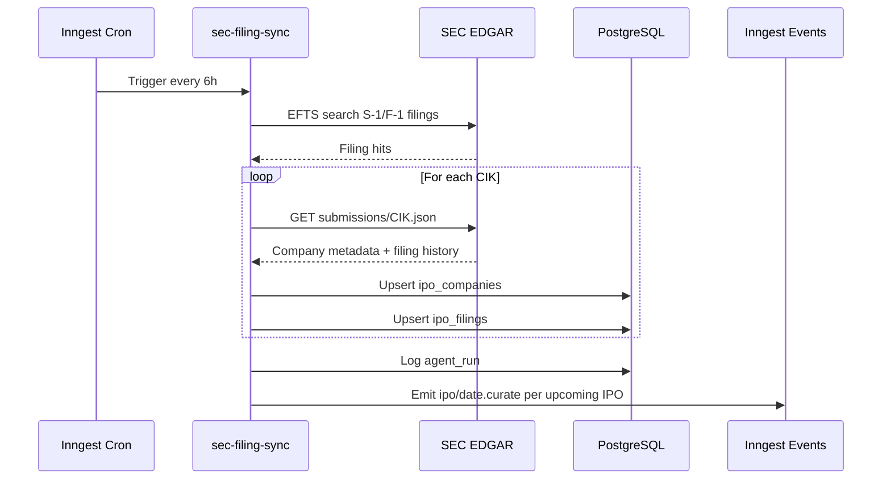

### 5.2 IPO date curation and risk analysis

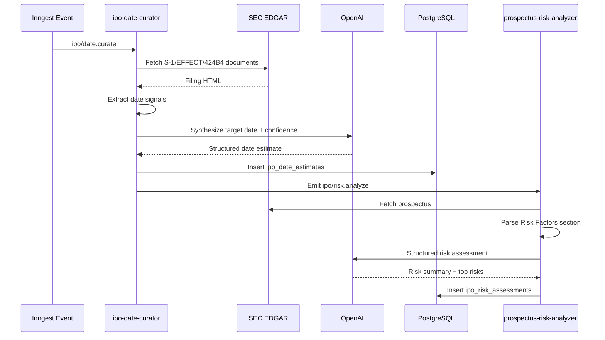

### 5.3 Price performance sync (hourly)

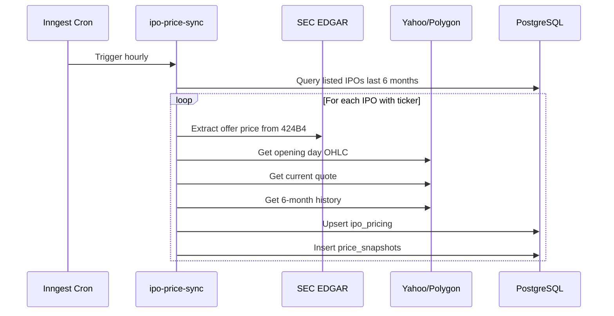

### 5.4 User browsing an IPO detail page

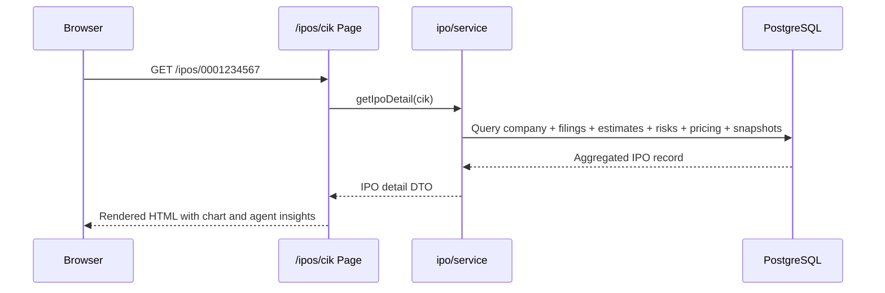

---

## 6. Database Architecture

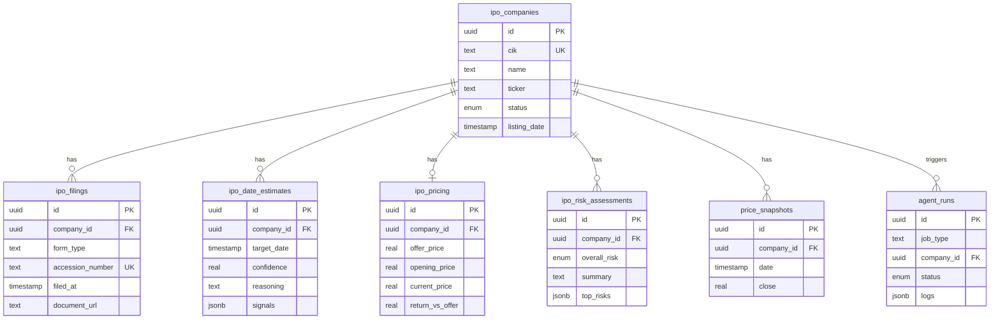

**Design decisions:**
- Companies are keyed by **CIK** (SEC Central Index Key), not ticker, because pre-IPO companies may not have a ticker yet.
- Agent outputs are **versioned** (new rows on each run) so users can see how estimates evolve as filings are amended.
- `price_snapshots` stores daily OHLC for charting 6-month performance trends.

---

## 7. Agent Architecture

The "agent" is not a single chatbot — it is a set of **specialized background pipelines** that run automatically:

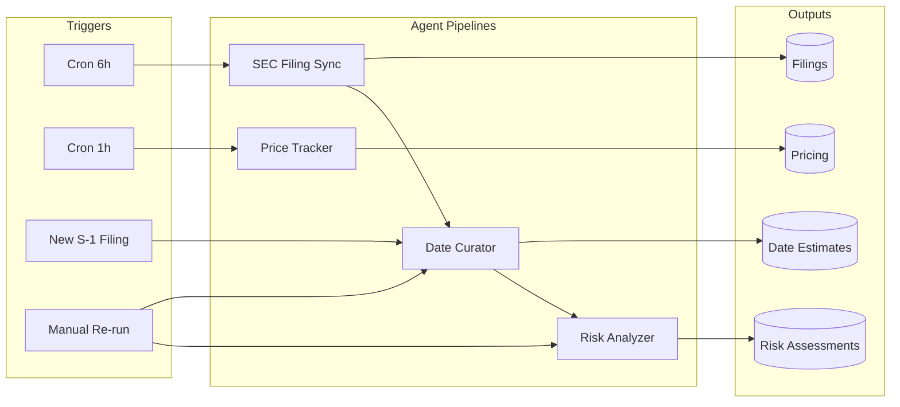

### Agent intelligence model

Each agent uses a **two-stage approach**:

1. **Deterministic parsing** — regex and HTML section extraction from SEC documents (fast, auditable, no API cost)
2. **LLM synthesis** (optional) — OpenAI `gpt-4o-mini` via Vercel AI SDK for structured JSON output when `OPENAI_API_KEY` is set

If no LLM key is configured, agents fall back to heuristics (EFFECT/424B4 date rules, keyword risk extraction) so the app remains functional.

---

## 8. External Integration Architecture

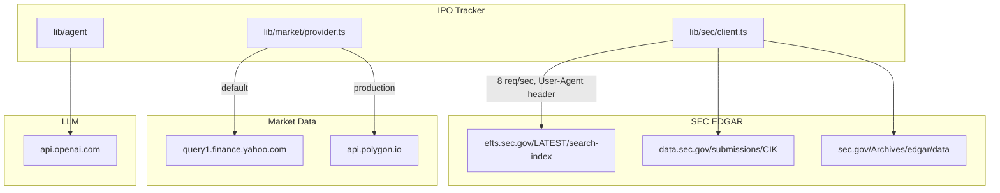

| Integration | Protocol | Rate / Auth | Caching |
|-------------|----------|-------------|---------|
| SEC EFTS search | HTTPS REST | 10 req/sec max; `SEC_USER_AGENT` required | 1 hour (`unstable_cache`) |
| SEC submissions | HTTPS REST | Same | 1 hour |
| SEC document fetch | HTTPS GET | Same | 1 hour |
| Yahoo Finance | HTTPS REST | Unofficial; no key | 5 min (quotes), 1 hour (history) |
| Polygon.io | HTTPS REST | API key in env | 5 min (quotes), 1 hour (history) |
| OpenAI | HTTPS REST | API key in env | None (per-request) |

---

## 9. Deployment Architecture

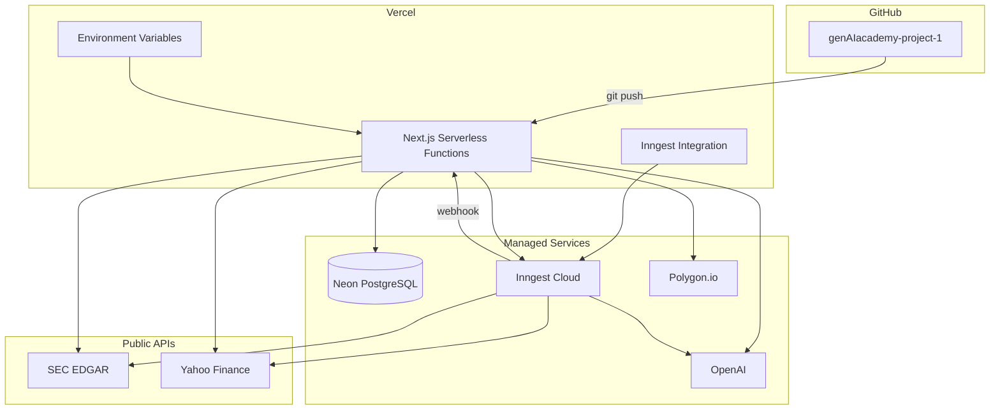

### Deployment components

| Component | Service | Role |
|-----------|---------|------|
| Application host | Vercel | Serves UI, API routes, Inngest handler |
| Database | Neon or Supabase | Persistent IPO, filing, and agent data |
| Job orchestration | Inngest (Vercel Marketplace) | Cron triggers, durable steps, retries |
| LLM | OpenAI | Optional agent intelligence |
| Market data | Yahoo (dev) / Polygon (prod) | Stock prices and history |

### Why Inngest instead of Vercel Cron alone?

| Concern | Vercel Cron | Inngest |
|---------|-------------|---------|
| Max duration | 10s (Hobby) / 5 min (Pro) | Durable steps, no single-timeout limit |
| Retries | None built-in | Automatic per-step retry |
| Multi-step workflows | Manual chaining | Native `step.run()` with state |
| Observability | Limited | Built-in dashboard and traces |

SEC document fetching + LLM analysis can exceed serverless timeouts. Inngest breaks these into durable steps that survive failures and retries.

---

## 10. Security Architecture

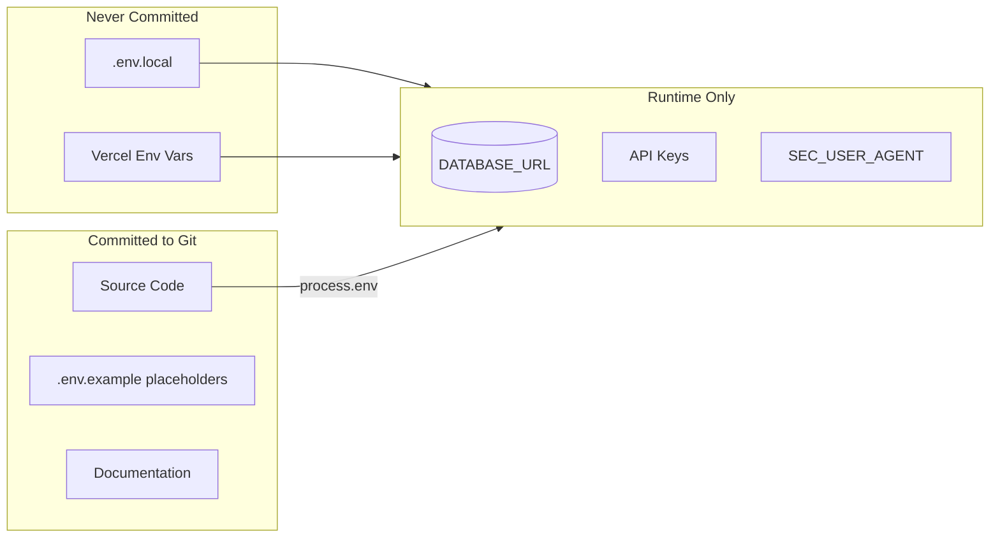

- **No secrets in source code** — all credentials read from environment variables at runtime
- **`.gitignore`** excludes `.env`, `.env.local`, and `.env*.local`
- **SEC compliance** — `SEC_USER_AGENT` identifies the application to EDGAR (required by SEC fair access policy)
- **No user authentication** in MVP — all endpoints are public read; write operations (sync, analyze) should be protected in production

---

## 11. Scalability and Limits

| Area | Current design | Future consideration |
|------|----------------|---------------------|
| SEC ingestion | Sequential CIK processing with 8 req/sec limiter | Batch via SEC bulk data files for larger backfills |
| Database | Single PostgreSQL instance | Read replicas if query volume grows |
| Agent runs | Up to 50 companies per sync cycle | Queue prioritization by filing recency |
| Market data | Per-ticker sequential fetch | Batch quote endpoints (Polygon) |
| UI | Server-rendered with client filters | Add pagination API for 1000+ IPOs |

---

## 12. Key Design Principles

1. **SEC as source of truth** — IPO discovery and dates are derived from official filings, not third-party calendars
2. **Provenance everywhere** — every curated date and risk score cites the source filing accession number
3. **Graceful degradation** — app works without OpenAI or Polygon; features degrade to heuristics and Yahoo
4. **Durable agents** — long-running work runs in Inngest steps, not in user-facing request paths
5. **Provider abstraction** — market data and LLM are behind interfaces, swappable without UI changes

---

## 13. Related Documentation

| Document | Contents |
|----------|----------|
| [README.md](README.md) | Quick start, env vars, deploy steps |
| [APPLICATION.md](APPLICATION.md) | Full user and operator guide |
| [.env.example](.env.example) | Environment variable template (placeholders only) |
